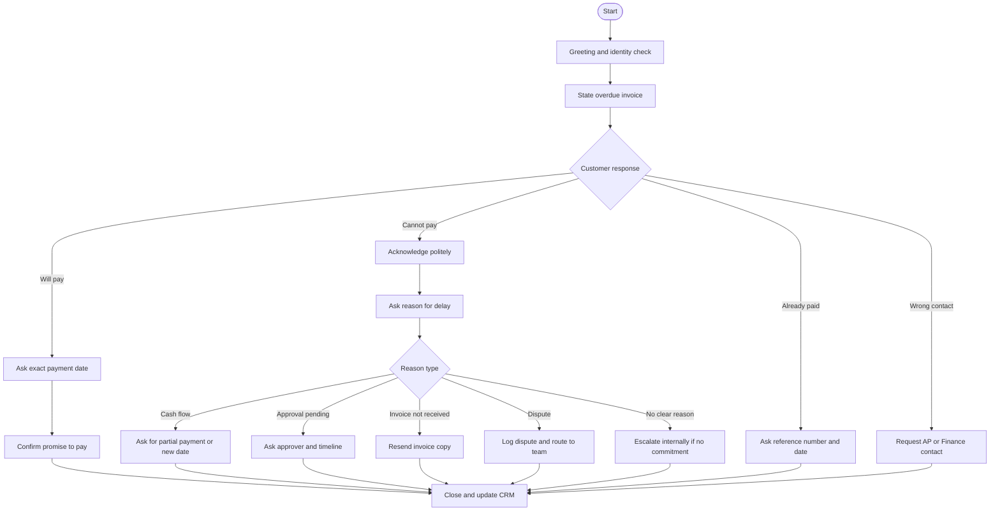

# DHL Express India — Conversational AI for Collections: Knowledge Base

> Source document: `Provisional_Requirement_Document_Apar.pdf` (Brief SoW | DHL Express India, marked **Confidential**, 7 pages).
> Audience: Engineering / solutioning agent that needs full context of the DHL ask before proposing or building.
> Document owner contact (per source): `yogesh.jhamb@dhl.com`.
> Status of source: **Provisional / Brief Statement of Work** — for DHL internal review and DHL-initiated vendor discussion only. Not for external distribution without written approval.

---

## 1. Executive Summary

The DHL Express India Finance Team is soliciting proposals for a **voice-based Conversational AI solution** that automates **collections** and **account-support** interactions with B2B customers. The system must place **outbound payment-reminder calls at scale (~100K calls/month, 90–120 seconds each)** and handle a smaller volume of **inbound account-support calls**. It must integrate (where feasible) with DHL's **SAP** environment, support **English plus Indian regional languages including Hinglish**, meet stringent **enterprise privacy/security/compliance** bars, and be deliverable via either **on-premises** or **SaaS/off-premise** deployment. A **Proof of Concept (PoC)** is the entry gate; volumes scale post-PoC.

The functional intent is concrete: replace/augment manual collections agents with an AI that can greet, identify, state overdue invoices, **negotiate**, **handle objections**, **capture promise-to-pay dates**, **route to humans on dispute/instalment/refund**, and **log structured outcomes** to CRM/spreadsheet/dashboard.

---

## 2. Document Index (as printed in the SoW)

1. Introduction
2. Scope Width
3. Purpose Statement
4. Requirement
5. Expected Competencies
6. "Show me how your agent acts in a random scenario" (test scenario)
7. Payment Collection Flow (call templates and branches)
8. Mermaid Flowchart (referenced; rendered as a decision diagram in source)
9. AI Behaviour
10. Decision Tree

---

## 3. Business Context & Purpose (the WHY)

- **Problem to solve:** improve collections effectiveness, reduce manual follow-up effort, accelerate payment closure.
- **Why voice (not email):** payment conversations need **immediate objection handling, commitment capture, and escalation decisions** that asynchronous email cannot deliver.
- **Conversation outcomes the AI must drive:**
  - Handle objections in real time.
  - Negotiate payment commitments.
  - Capture outcomes in a **structured way** (CRM/dashboard dispositions).
- **Invoice types in scope:** **Duty invoices and Freight invoices**, both **Import and Export**.
- **Customer base:** primarily **B2B**.

---

## 4. Scope Width

### 4.1 Priorities

**1st Priority — Outbound calls to customers**
1. Payment reminders, follow-ups, negotiations, and guidance.
2. Credit-limit-breach alerts (during PoC).
3. Addressing customer queries, providing guidance, and connecting to a human agent if necessary.

**2nd Priority — Inbound calls from customers**
1. Invoice copy & paperwork requests.
2. Disputes covering Weight / Pricing / DTP (Duty/Tax/Paid).
3. Email-ID updates.
4. First-time resolution (FTR).

### 4.2 Volume

| Channel | Categories | Volume |
|---|---|---|
| Outbound + Inbound combined | Freight Invoices, Duty Invoices, Alerts | **~100,000 calls/month**, **90–120 seconds** each, **expandable post-PoC** |

### 4.3 Deployment options

The vendor may propose either:
- **On-premises** deployment, or
- **SaaS / off-premise** service.

---

## 5. Functional Requirements

### 5.1 Core requirement

A Conversational AI that can manage **high-volume customer outreach** while remaining **compliant, scalable, operationally efficient**, supporting both:
- **Outbound payment reminders**, and
- **Inbound account-support queries**,

with **measurable control** over:
- Latency,
- ASR (Automatic Speech Recognition) accuracy,
- Concurrency,
- Governance.

### 5.2 Specific functional asks

- Outbound calls go primarily to **B2B customers** for: first-time payment reminders, follow-ups on previous calls, account-related alerts.
- **CRM = SAP** (global, enterprise-grade, on-premises). The vendor must:
  - Share a case study if they have integrated with **SAP** for a similar workload, OR
  - Propose **how data will be supplied** to the vendor for outbound calling and follow-up if they have **not** worked with SAP.
- The agent must converse in **English and primary Indian regional languages**, explicitly including **Hinglish**.
- **Data residency preference:** call recordings, transcripts, and metadata should be stored **directly on DHL-owned servers**, **OR** transferred via **SFTP**, with the additional condition that the data is **deleted from vendor servers after a defined timeline**.
- **Delivery model:** **agile, weekly sprints**, covering: discovery → solution design → PoC → integration → UAT → deployment.

### 5.3 Inbound use cases the solution must handle

- Invoice and document retrieval.
- Password reset guidance.
- Weight-dispute and billing-error escalations, with **clear categorisation and routing logic**.

---

## 6. Expected Competencies (from the SoW table; "inter-alia but not limited to")

| Aspect | What DHL requires |
|---|---|
| **Conversational tone & personalization** | Natural, human-like tone; **no rigid/transcriptive scripts**. Must adapt to context, customer history, and prior interaction outcomes. |
| **Payment-recovery negotiation & multilingual support** | Trained in payment-recovery negotiations: deferring payments, proposing payment plans (optional), handling objections, escalating to human agents when required. **Dynamic language switching**. Polite-but-assertive tone. Must maintain **DHL-compliant policies**. |
| **Performance & scalability KPIs** | Vendor must commit benchmarks for: **Latency** (end-to-end response time); **ASR accuracy per language and region**; **Concurrent call capacity** (peak and sustained); **RAG / context-aware retrieval precision** for account queries; **Guardrails** — PCI-compliant payment-detail handling, PII redaction, escalation rules, tone-compliance. |
| **Inbound call support** | Invoice/document retrieval; password-reset guide; weight-dispute / billing-error escalation with clear categorisation and routing. |
| **Data handling & security** | Compliance with **GDPR, SOC frameworks, HIPAA (where applicable), EU AI Act, NIST CSF, DORA, India's DPDP Act, Information Technology Act**. |

---

## 7. Non-Functional / Compliance Requirements

### 7.1 Regulatory / standards landscape (must comply)
- **GDPR** (EU data protection)
- **SOC** frameworks (e.g., SOC 2)
- **HIPAA** — where applicable
- **EU AI Act**
- **NIST CSF** (Cybersecurity Framework)
- **DORA** (Digital Operational Resilience Act, EU financial sector)
- **India's DPDP Act** (Digital Personal Data Protection Act)
- **India's Information Technology Act**

### 7.2 Privacy & data-handling controls
- **PII redaction** in transcripts/recordings.
- **PCI-compliant** handling of any payment details exchanged on call.
- **Tone-compliance** guardrails (no abusive/coercive language).
- **Auditability** of conversations and decisions.
- **Deletion** from vendor servers after a defined retention timeline; final residency on DHL servers or via SFTP transfer.
- **Operational resilience** (DORA-aligned).

### 7.3 Performance KPIs the vendor must commit
- End-to-end latency (target unspecified — vendor proposes).
- ASR accuracy split **per language and per region**.
- Concurrent call capacity at peak and sustained.
- RAG / context-retrieval precision for account-related queries.

---

## 8. Test Scenario (Section 6 of SoW): "Mind Your Business Inc."

DHL provided a concrete simulation the vendor's agent must demonstrate against.

### 8.1 Customer & contact
- **Company:** Mind Your Business Inc.
- **Contact persons:** Mr. Anthony Gressive **or** Mrs. Anna Gressive.
- **Direct phone:** 9813640644.
- **Registered email on file:** `Anthony@mybiz.com` (single source of truth for invoice resends and proof-of-payment correspondence with this customer).

### 8.2 Outstanding invoices

| Account # | Invoice # | Outstanding (₹) | Overdue Days | Invoice Date | Telephone |
|---|---|---|---|---|---|
| DHL001 | DHL123456 | ₹13,600 | 60 | 1-Jan-26 | 9813640644 |
| DHL001 | DHL654321 | ₹34,650 | 45 | 1-Feb-26 | 9813640644 |
| DHL001 | DHL332241 | ₹9,670 | 30 | 1-Mar-26 | 9813640644 |

**Total outstanding:** ₹57,920 across three invoices.

### 8.3 Historical context the agent must hold
- **DHL123456** — customer earlier raised a price-list vs invoice mismatch on **1 waybill**. **Resolved**; **credit note issued**.
- **DHL654321** — issue logged for **2 delayed shipments**. **Resolved**; **credit note issued some time ago**. The week after the credit note, DHL called the customer; **customer confirmed receipt of the credit note**.
- **All issues resolved**, no further open issues, **but no payment received yet** per DHL data.

### 8.4 Goals the agent must achieve on this call
1. Find out **why** payment has not been made.
2. Get a **payment promise date** from the customer.
3. Provide **payment options** — **DHL MyBill Portal** and **Virtual Account Number**.

### 8.5 Conduct rules the agent must obey
1. Stay in control of self and conversation.
2. Start with greetings; **listen actively**.
3. Ask the right questions; **negotiate**.
4. Use effective language; assertive tone.
5. Show empathy.
6. Use the right tactics.
7. **Do not abuse**.

### 8.6 Sentiment / intent reading
The agent must judge whether the customer is **deploying delay tactics** vs **genuinely cash-strapped**, and adapt accordingly.

### 8.7 Hand-off rules
For **instalments, disputes, or refund queries** — take notes, and **connect to a human agent if the customer insists**.

**Human escalation contact (provided in SoW):**

| Name | Designation | Phone |
|---|---|---|
| Ms Sanorita | Collections Executive | 09416340644 |

---

## 9. Payment Collection Call Flow (Section 7)

### 9.0 Agent identity (fixed for this PoC)
The voice agent is **always male**, name **Yogesh**, calling on behalf of DHL Express India. All scripts below, in every language, must use masculine self-reference (e.g. Hindi/Hinglish "main … kar raha hoon", not "kar rahi hoon"). The realtime voice configured in the backend must map to a male voice persona named Yogesh; the deterministic fallback templates must also speak as Yogesh.

### 9.1 First-time reminder template (unpaid, due date passed)

**Opening identity check:**
> "Hello, am I speaking with [Customer Name / AP Team] from [Company Name]?"

**Branches off opening:**

| Customer reply | Agent action |
|---|---|
| **No / wrong person** | "Could you please connect me to the person handling accounts payable or payments for your company?" |
| **Concern person on leave** | "I would appreciate if you can connect me with an alternate person in absence of [Anthony] because I see there are several outstanding invoices in your DHL account due to which the account's credit-worthiness may get impacted." |
| **Yes / correct person** | Greet + introduce → state purpose. |

**Standard introduction (correct person):**
> "Good afternoon/morning/evening, my name is Yogesh and calling from DHL Express India. This is regarding your credit account with DHL with total outstanding of [₹__]. We have an unpaid invoice [Invoice No.] dated [Date] for [₹Amount], which was due on [Due Date]. The payment is currently overdue. Could you please pay the invoice."

### 9.2 Branches after stating overdue invoice

**A. Customer confirms paying soon**
> "Thank you. Could you please share the expected date of payment?"

- **If date is vague or > 2 days away:** "Sorry, it seems your provided date is too far. I request you to provide a specific date within 2 business days?"

**B. Customer claims already paid**
> "Understood. Could you please email the payment proof to `yogesh.jhamb@dhl.com` with transaction reference number and date? I'll verify with our system and revert within 24 hours."
- **Post-call:** raise an internal query and schedule a follow-up if a mismatch is found.

**C. Customer denies / cannot pay**
> "I understand. Thank you for sharing that with me."
- Then probe reason (see 9.3).

### 9.3 Reason-of-delay sub-tree (with collection target: **before the 25th of every month**)

Lead-in: *"May I know the reason for the delay so that I can note it correctly?"*

**A. Cash flow issue**
- Ask for partial payment now, or a confirmed date for full payment.
- If date given → "Thank you. I will note that payment will be made by [Date]. Please ensure the payment is released by then."
- If no date → "I request you to share at least an expected timeline, so we can update our records and **avoid putting account on stop which may stop you from creating shipments**." (escalation lever: shipment stop)

**B. Internal approval / PO pending**
- "Could you please confirm the approver name or expected approval date?"
- "I request you to prioritize this, as the invoice is already overdue."

**C. Invoice not received**
- Guide to **MyBill self-serve portal**: customer logs in with **registered email + password**.
- If MyBill access fails → offer to send invoice copy to registered email.
- Ask: "Can you please confirm your registered email and for which invoice number you need a softcopy?"
  - If email **matches master records** → email the DHL query team, which auto-triggers invoice delivery to customer email. Thank customer; confirm delivery imminent.
  - If email **does not match** → take the new email and route to the respective **CCE** (Customer Care Executive) for action.
- Close: "Once you receive it, kindly review and arrange payment at the earliest."

**D. Dispute on charges**
- "I understand your concern. Could you please specify the dispute reason?"
- "We will log this as a dispute and connect you with the concerned team. In the meantime, may I request you to clear the **undisputed amount** (if any)?"

**E. Temporary business issue / payment cycle not reached**
- "I understand. However, this invoice is overdue, and payment is required as per agreed terms."
- "Please help us with either a payment date or when your payment cycle runs. It would be great if you can provide the name of the person responsible for this matter."

### 9.4 Escalation path
> "I respect your position, but I must note that the payment remains overdue. You may expect a call from the [collections agent] on this case for further follow-up. Before I close the call, can I confirm your preferred contact number and email for future communication?"

### 9.5 Closing

| Outcome | Closing line |
|---|---|
| **Customer commits** | "Thank you for your cooperation. I have noted your commitment for [Date]. We will follow up if needed." |
| **No commitment** | "Thank you for your time. We will update our records and do the needful action as per process. Have a good day." |

---

## 10. AI Behaviour (Section 9)

- Tone: **polite but firm**.
- **Do not argue** with the customer.
- **Always push for a specific date** when a commitment is being captured.
- Offer: invoice resend, dispute handling, or accept whatever amount the customer can pay (partial).
- **Capture every outcome** in **CRM / connected spreadsheet / dashboard** with one of the **dispositions**:
  - `refusal`
  - `reason` (for delay)
  - `promise-to-pay`
  - `dispute`
  - `escalation`

---

## 11. Decision Tree (Section 10) — canonical branching

**Start**
- Greet customer; confirm identity.
- State purpose: overdue invoice reminder.
- Ask for payment status.

**Branch: customer says payment will be made**
- Ask exact payment date.
- Confirm commitment.
- Close politely.
- Update CRM/dashboard with promise-to-pay date.

**Branch: customer says "I cannot make the payment"**
- Acknowledge politely.
- Ask reason for delay.
- Sub-branch by reason:
  - **Cash flow issue** → ask for partial payment or revised date.
  - **Approval pending** → ask for approver status and timeline.
  - **Invoice not received** → resend invoice; confirm email.
  - **Dispute on charges** → log dispute; route to relevant team.
  - **No clear reason / refusal** → request payment date or responsible contact.
- If still no commitment → inform escalation; close politely.

**Branch: customer says already paid**
- Ask for payment reference and date.
- Confirm verification process.
- Close.

**Branch: customer is not the right contact**
- Ask for Accounts Payable / Finance person.
- Record new contact details if available.
- Close.

---

## 12. Mermaid Flowchart (Section 8) — reconstructed

The PDF embeds a flowchart image. Reconstruction in Mermaid syntax:

---

## 13. Key Domain Vocabulary (so an agent reads the SoW correctly)

| Term | Meaning in this SoW |
|---|---|
| **DHL Express India** | The buyer; specifically the **Finance Team** procuring this AI. |
| **PoC** | Proof of Concept — gate before scale-up. |
| **B2B** | All target customers are businesses, not consumers. |
| **SAP** | DHL's CRM / enterprise system, **on-premises, global**. Integration target. |
| **CRM** | DHL uses SAP as CRM; outcomes must be written back here (or to a connected spreadsheet/dashboard during PoC). |
| **MyBill** | DHL's self-serve invoice portal. Customer logs in with registered email + password. |
| **CCE** | Customer Care Executive — internal DHL role that actions email-mismatch cases. |
| **DTP** | In dispute categorisation context — Duty/Tax/Paid related. |
| **ASR** | Automatic Speech Recognition — must be benchmarked per language/region. |
| **RAG** | Retrieval-Augmented Generation — required for context-aware account queries. |
| **Hinglish** | Code-mixed Hindi-English — explicitly listed as a target language. |
| **Promise-to-Pay (PTP)** | A captured commitment with a specific date; a primary KPI of the agent. |
| **Disposition** | Final outcome label written to CRM after each call. Allowed set: `refusal`, `reason`, `promise-to-pay`, `dispute`, `escalation`. |
| **Credit-limit breach alert** | Outbound alert use case included in PoC scope. |
| **Virtual Account Number** | One of two payment options the agent must offer (alongside MyBill Portal). |
| **Account on stop** | Consequence lever — overdue accounts can be put on stop, blocking new shipment creation. The agent uses this as a polite leverage. |
| **25th of the month** | Soft target — the agent is instructed to try its best to collect **before the 25th** of every month. |

---

## 14. Operational / Delivery Constraints

- **Sprint cadence:** weekly.
- **Phases:** Discovery → Solution Design → PoC → Integration → UAT → Deployment.
- **Data movement:** prefer DHL-owned storage; SFTP transfer permitted; **vendor must purge after defined retention**.
- **Languages day-1:** English + key Indian regional languages, including **Hinglish**.
- **Volume planning baseline:** 100K calls/month at 90–120s; design for elastic expansion post-PoC.
- **Hand-off target:** human collections executive (e.g., Ms Sanorita, 09416340644 in the test scenario) for instalments/disputes/refunds when customer insists.

---

## 15. Implicit / Inferred Requirements (read between the lines)

These are not stated as bullets in the SoW but are necessary to satisfy what *is* stated:

1. **Telephony stack** capable of placing ~100K outbound dials/month with sustained concurrency — vendor must spec dialler capacity and IVR/voice-bot integration.
2. **Speaker / contact verification** — the opening identity-check branch implies the bot must accept "no/wrong person" gracefully and be safe to leave a message or get re-routed without leaking PII.
3. **Multi-turn state memory across calls** — "follow-ups on previous calls" requires per-customer conversation history and prior dispositions to be reachable at dial-time.
4. **Sentiment classifier** — explicitly required to distinguish *delay tactics* from *genuine cash crunch*; this is a model output the orchestration must consume to pick branches.
5. **Live human-agent transfer** — warm/cold transfer to a real collections executive (Ms Sanorita's number serves as the test target). Mid-call handover infra is implied.
6. **Email side-channel** — agent must be able to trigger invoice resends and accept proof-of-payment via email (`yogesh.jhamb@dhl.com` is the demo address).
7. **Master data lookup** — registered-email match against DHL master records is part of the in-call decision logic. Implies a real-time customer master read.
8. **Audit trail per call** — call recording + transcript + structured disposition written back, retained on DHL infra, deletable from vendor.
9. **Tone & abuse guardrails** — the SoW explicitly forbids abuse and demands polite-yet-assertive tone, requiring an output-side moderation layer.
10. **Localization beyond translation** — regional politeness norms, code-mix handling (Hinglish), and language auto-switching mid-call.

---

## 16. Open Questions / Items the Vendor is Expected to Propose

(Phrased so a downstream agent can ask DHL or fill in.)

1. **Concrete latency target** (ms end-to-end) — vendor commits.
2. **Required ASR accuracy threshold per language** — vendor commits with regional split.
3. **Concurrency targets** — peak vs sustained.
4. **Retention timeline** — exact days/weeks for vendor-side deletion after transfer to DHL.
5. **SAP integration mode** — direct API, middleware, file-based, or batch via SFTP if SAP integration not feasible.
6. **PoC success criteria** — collection-rate uplift? PTP capture rate? FTR rate? (Not numerically defined in SoW.)
7. **Payment-plan policy** — instalments are listed as "optional" capability; DHL has not specified the allowed plan structures.
8. **Languages day-1 list** — "primary regional languages" is not enumerated beyond mentioning Hinglish/English.
9. **Working hours / call windows** — not specified; assume B2B business hours unless told otherwise.
10. **Compliance evidence package** — which certifications must be produced (SOC 2 Type II report, DPDP DPA, etc.).

---

## 17. Quick-Reference Checklist for an Implementation Agent

- [ ] Build outbound dialler integration with elastic concurrency for 100K/month at 90–120s.
- [ ] Build inbound IVR/voice-bot for 4 inbound use cases (invoice copy, disputes, email update, FTR).
- [ ] Integrate to SAP (read customer/invoice/credit-note, write disposition) — or define SFTP/file fallback.
- [ ] Implement multilingual ASR + TTS including Hinglish; per-language accuracy SLAs.
- [ ] Implement RAG over DHL account/invoice context.
- [ ] Implement guardrails: PII redaction, PCI handling, tone/abuse filter, escalation rules.
- [ ] Implement decision-tree orchestration matching Sections 9–11 of this doc.
- [ ] Implement sentiment / delay-tactics-vs-genuine classifier.
- [ ] Implement live human transfer to collections executive with context handoff.
- [ ] Implement email side-channel for invoice resend and payment-proof intake.
- [ ] Implement CRM/dashboard write-back with the 5 dispositions (`refusal`, `reason`, `promise-to-pay`, `dispute`, `escalation`).
- [ ] Implement recording + transcript pipeline to DHL servers (or SFTP) with vendor-side retention purge.
- [ ] Compliance hardening: GDPR, SOC, EU AI Act, NIST CSF, DORA, DPDP, IT Act (and HIPAA where applicable).
- [ ] Agile delivery: weekly sprints across Discovery → Design → PoC → Integration → UAT → Deployment.
- [ ] Pass the "Mind Your Business Inc." live demo scenario end-to-end.

---

## 18. Source Provenance

- File: `Provisional_Requirement_Document_Apar.pdf` (262.7 KB, 7 pages).
- Watermarked **Confidential**.
- Footer on every page: "For DHL Internal Review and DHL-Initiated Vendor Discussion Only. Not for external distribution, reproduction, or use outside this engagement without written approval from DHL Express India. For any feedback, write to yogesh.jhamb@dhl.com."
- Title: "Brief SoW | DHL Express India".
- All quoted scripts, names, phone numbers, invoice numbers, and amounts in this knowledge base are reproduced from the source for fidelity to the demo/test scenario.
